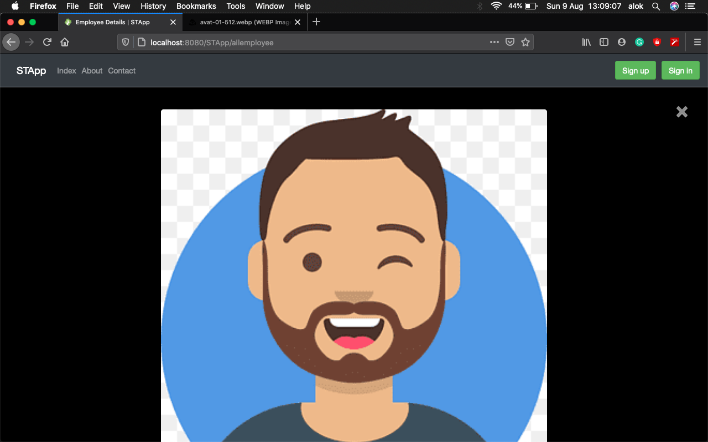
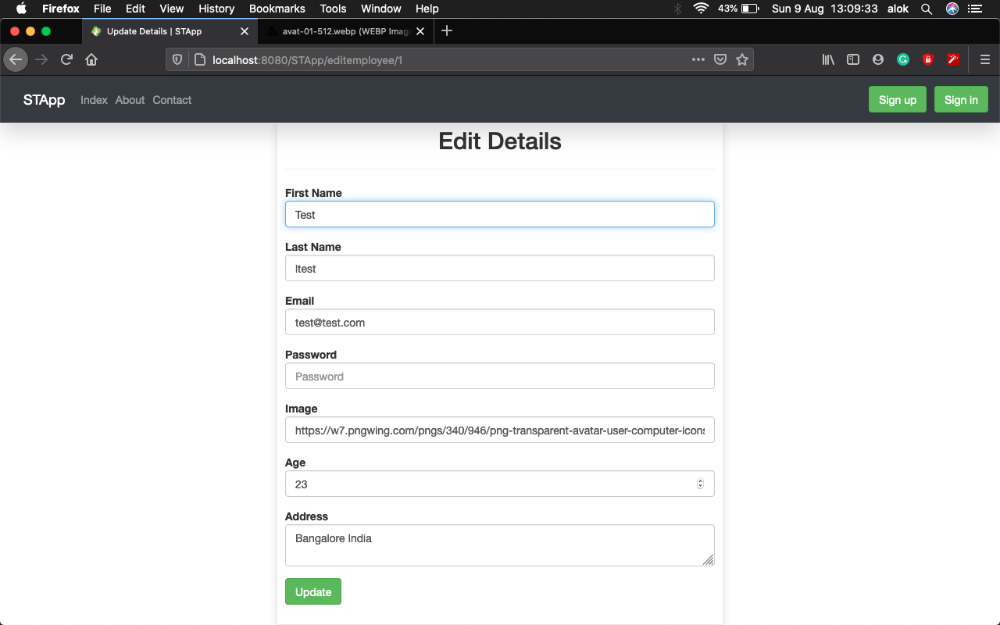

# STApp
This project is Simple Tapestry Application
## Screenshots
### 1. Home with Reusable component ***header***.

### 2. Employee Login.

### 3. Employee Sign up.

### 4. Login Failed.

### 5. Employee Dashboard.

### 6. All Employees Detail with Ajax.

### 7. Showing Image In Popup

### 8. Employee Edit Page

