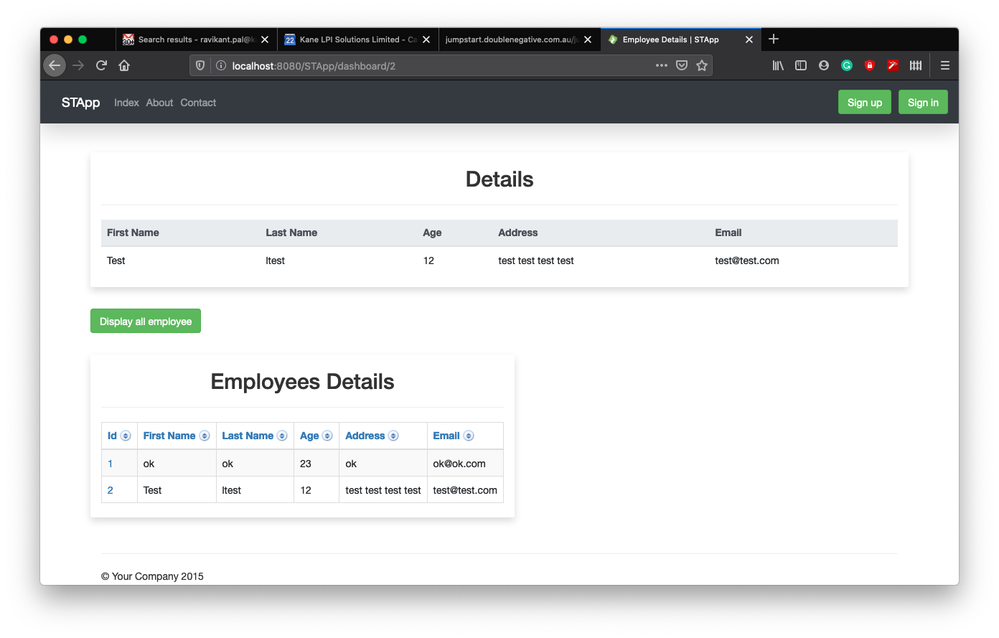
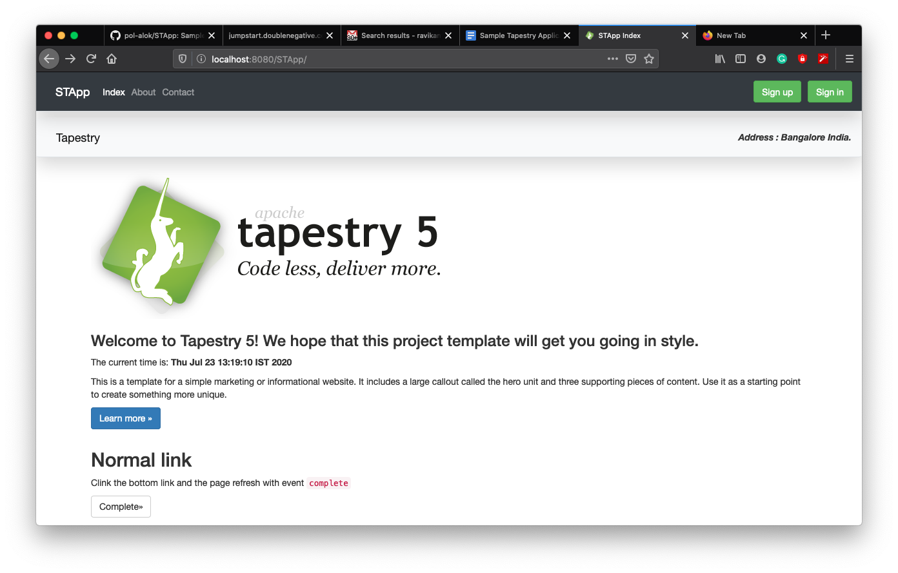

# STApp
This project is Simple Tapestry Application
## Screenshots
### 1. Home

### 2. Employee Login.

### 3. Employee Sign up.

### 4. Login Failed.

### 6. Employee Dashboard.

### 6. All Employees Details.

### 7. All Employees Details with Ajax.

### 7. Index page with Reusable component ***header***.

